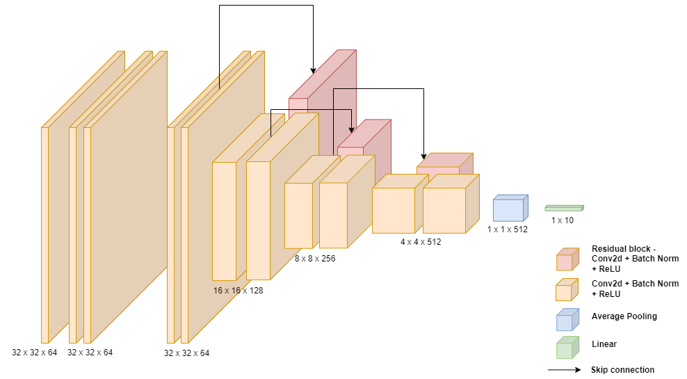

# Deep-Learning-Mini-Project

## Goal

##### Coming up with a modified residual network (ResNet) architecture with the highest test accuracy on the CIFAR- 10 image classification dataset, under the constraint that your model has no more than 5 million parameters.

## Our Proposed Architecture

## Repository Structure

- `models/` 
  - `.py` files - contains all the model architecture we experimented on using grid search, hyperparameters were tuned, and configurations were employed.
- `besthyperparams.json` - Hyperparameters for the best model.
- `gridsearch.py` - python script to train all the models present in `./models`, with all combinations of specified hyperparameters. It trains 45 models in total. 5 resnet variations with 9 combinations of hyperparameters each.
- `main_job.sbatch` - slurm job for running `gridsearch.py` on clsuters.
- `main_output` - output after running the slurm job.
- `resnet10.ipynb` - contains code for the most accurate model. 
- `arc.png` - our model architecture

## Authors
- Arushi Arora: aa10350@nyu.edu
- Saaketh Koundinya : sg7729@nyu.edu
- Shreya Agarwal : sa6981@nyu.edu
